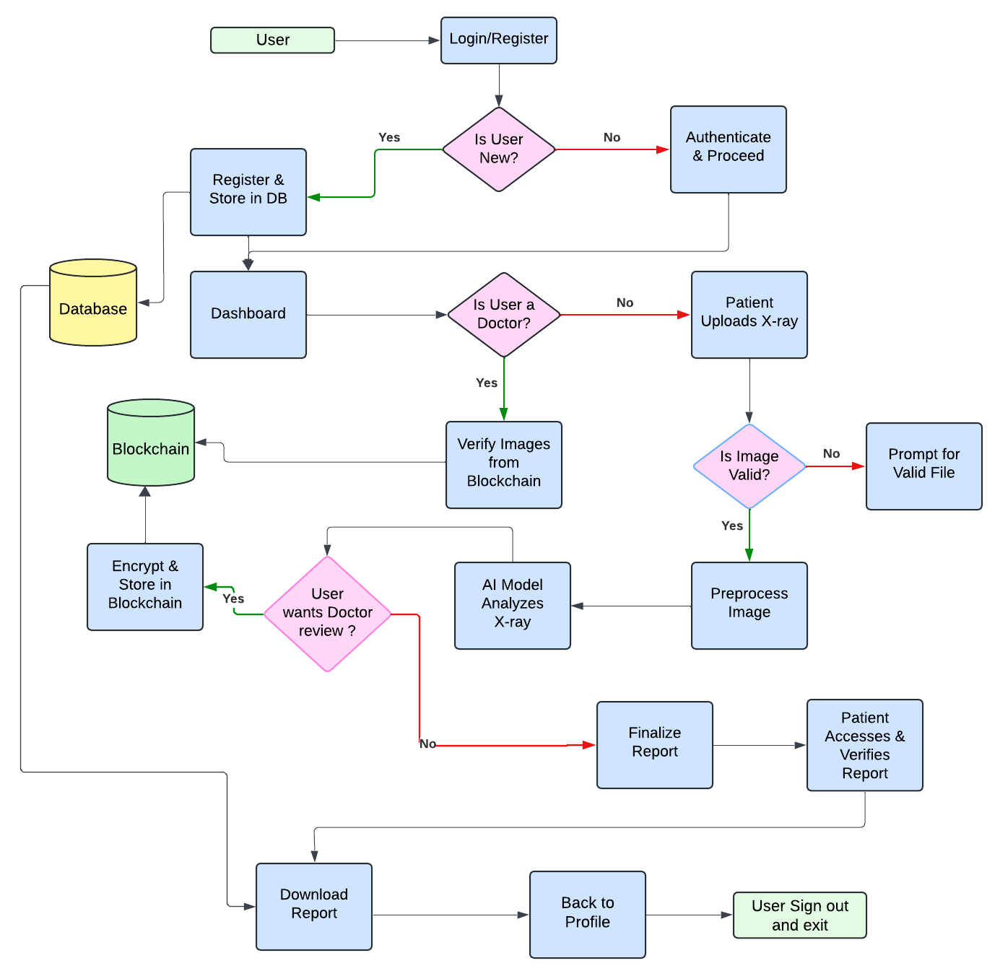

# MedChain-X: Secure Medical X-Ray Diagnosis with AI and Blockchain

MedChain-X is an AI-driven web platform designed to streamline medical diagnosis from chest X-rays, while ensuring data immutability and security through blockchain and decentralized storage.

---

## 🚀 Overview

MedChain-X integrates deep learning, blockchain, and secure cloud technologies to deliver:
- Fast, accurate predictions from chest X-rays using CNN models.
- Decentralized, tamper-proof data storage using Ethereum and IPFS (via Pinata).
- Role-based access control for Lab Incharges, Doctors, and Admins.
- Automatic PDF report generation and secure consultations.

---

## 🎯 Project Objectives

- Automate disease detection from chest X-rays using AI.
- Securely store and verify medical data using blockchain.
- Enable authenticated medical consultations with traceable records.

---

## 🔍 Features

- ✅ **AI-Powered Diagnosis**: Classifies diseases like pneumonia or COVID-19 from chest X-rays using a fine-tuned CNN.
- 🔒 **Blockchain Integration**: Stores immutable hashes of patient data on Ethereum smart contracts.
- ☁️ **IPFS Storage**: X-ray images are securely uploaded and retrieved via Pinata.
- 🧑‍⚕️ **Role-based Access**: Role-specific dashboards for Lab Incharges and Doctors.
- 🧾 **Auto Report Generation**: PDF diagnosis reports are downloadable via the frontend.
- 📊 **Doctor Dashboard**: Doctors can fetch and review on-chain records using Record ID.

---

## 🛠 Tech Stack

| Layer         | Technology                          |
|---------------|--------------------------------------|
| Frontend      | React.js, Bootstrap CSS              |
| Backend       | Flask, REST APIs                     |
| AI/ML         | PyTorch (CNN), TensorFlow (support)  |
| Blockchain    | Solidity Smart Contracts (Deployed via MetaMask) |
| Storage       | IPFS (via Pinata Gateway)            |
| Authentication| JWT Tokens                           |
| Database      | SQLite (local testing)               |
| Report Gen    | Google Gemini API (for summaries)    |

---

## 🧩 System Components

### 👤 Authentication
- Role-based login: Lab Incharge / Doctor
- Signup & Login backed by JWT
- Stored in `users.db`

### 🧪 Prediction Workflow
- Upload X-ray → Sent to Flask API
- Preprocessed & fed to CNN model
- Prediction + Confidence returned

### 📦 Decentralized Storage
- X-ray images uploaded to IPFS via Pinata
- Returns CID used for permanent access

### 🔗 Blockchain Flow
- Solidity smart contract (`MedChainXRecords`)
- Stores `patientName`, `age`, `prediction`, `imageCID`, `timestamp`, `addedBy`
- Event `RecordAdded` used to retrieve record ID

### 👨‍⚕️ Doctor Consultation
- Doctor can view blockchain-backed cases
- On-chain verification of data & image
- Doctor fetches record using Record ID

---

## 🔁 System Workflow



---

## 📦 Installation

### 🔧 Prerequisites

- Node.js (v16+)
- Python 3.8+
- MetaMask extension (browser)
- Ganache / Testnet account (optional)
- Pinata (for IPFS)
- Google Gemini API key (for AI-generated summary)

### 🧪 Setup

#### 1. Clone the Repository

```sh
git clone https://github.com/kshitij7704/MedChain-X.git
cd MedChain-X
```

#### 2. Frontend

```sh
cd Frontend
npm install
npm start
```

#### 3. Backend

```sh
cd Backend
pip install -r requirements.txt
python app.py
```

#### 4. Smart Contract

- Deploy `MedChainXRecords.sol` via Remix or Truffle.
- Add the ABI and Contract Address in `Frontend/src/contract/MedChainX.js`.

---

## 📚 References

- Sanida et al., *An advanced deep learning framework for multi-class diagnosis from chest X-ray images*, MDPI, 2024.
- Chaudhary et al., *Diagnosis of chest diseases in X-ray images using deep CNNs*, IEEE, 2019.
- Sun et al., *A blockchain-based secure storage scheme for medical information*, JWCN, 2022.
- [NIH ChestX-ray14 Dataset](https://nihcc.app.box.com/v/ChestXray-NIHCC)
- [Pinata IPFS API Docs](https://docs.pinata.cloud/)
- [Solidity Documentation](https://docs.soliditylang.org/)
- [Gemini API Docs](https://ai.google.dev/)

---

## 📄 Deliverables

✅ Responsive Full-stack Web Application <br>
✅ Trained AI Model for Disease Prediction <br>
✅ Integrated Smart Contract (Ethereum-compatible) <br>
✅ Generated PDF Reports <br>
✅ Secure IPFS File Handling via Pinata <br>

